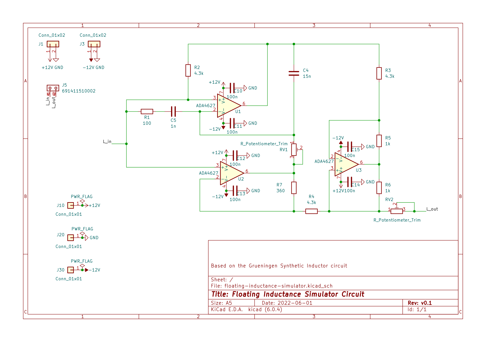
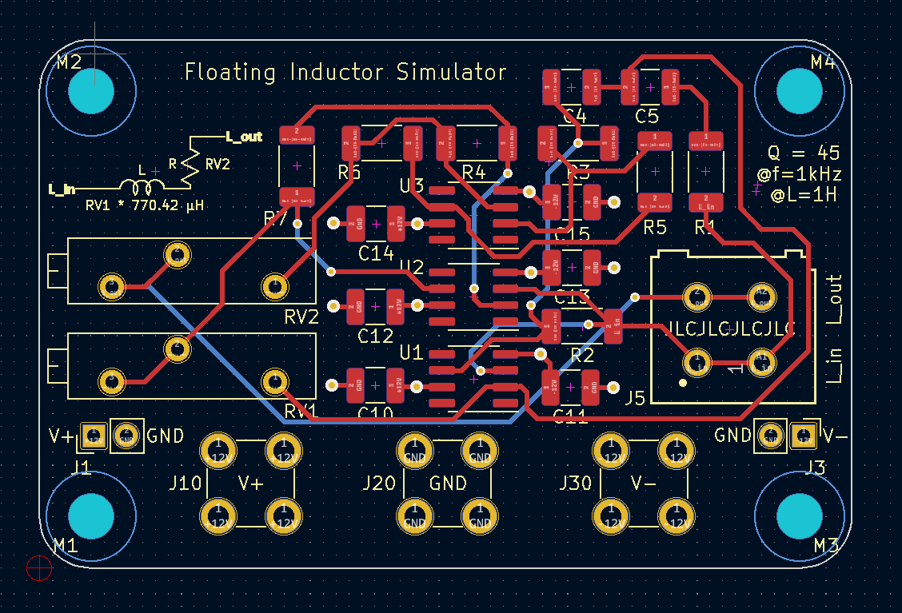
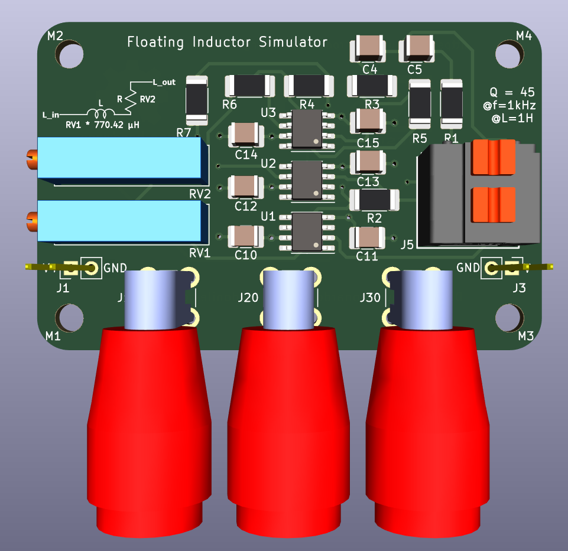
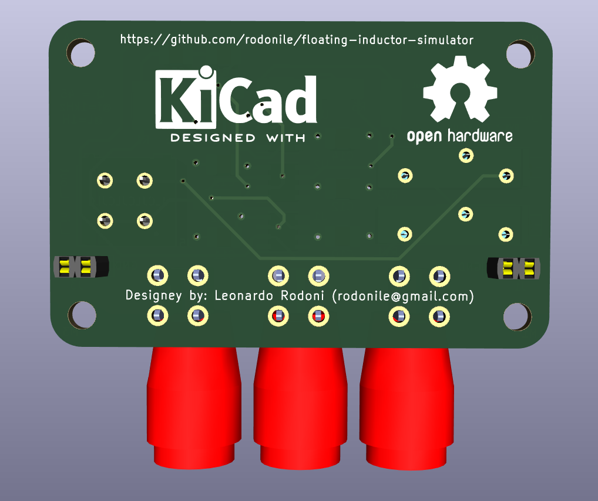
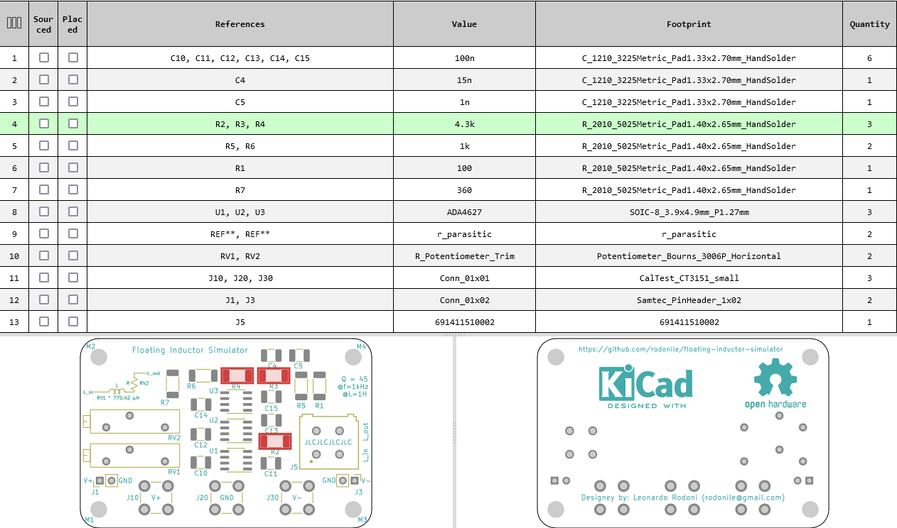

# floating-inductor-simulator
PCB design (KiCAD) of a floating inductor simulator circuit. The circuit can be used to simulate inductors up to ~50H, that would otherwise be quite big in size.

## Schematics

## Layout and 3D view

3D view TOP                |  3D view BOTTOM
:-------------------------:|:-------------------------:
  |  

## Bill of materials (BOM)

The bill of material is also available in the [ibom.html](ibom.html) file (interactive html format, to be opened with a web browser).

## Gerbers
Gerber files are available in [releases](./releases). The board is a 4-layer PCB. Designed with JSCPCB design rules. 